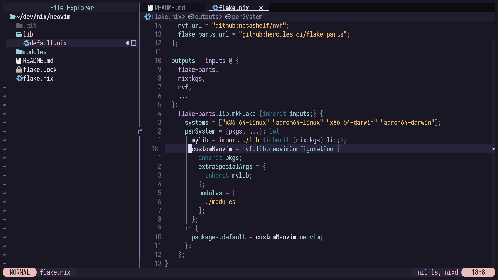

# Neovim Flake



## Getting started

### Run without installation

To test configuration without installing it, run the following command:

```bash
nix run github:drxxmy/neovim
```

### NixOS

```nix
{
  inputs = {
    custom-neovim.url = "github:drxxmy/neovim";
  };

  outputs = {custom-neovim, ...}: let
    system = "x86_64-linux";
  in {
    # Example nixosConfiguration using the configured Neovim package
    nixosConfigurations = {
      yourHostName = nixpkgs.lib.nixosSystem {
        # ...
        modules = [
          # This will make custom neovim available in your system packages
          ({pkgs, ...}: {
            environment.systemPackages = [custom-neovim.packages.${system}.neovim];
          })
        ];
        # ...
      };
    };
  };
}
```

### Home-Manager

```nix
{
  inputs = {
    home-manager.url = "github:nix-community/home-manager";
    custom-neovim.url = "github:drxxmy/neovim";
  };

  outputs = {home-manager, custom-neovim, ...}: let
    system = "x86_64-linux";
  in {
    # Example Home-Manager configuration using the configured Neovim package
    homeConfigurations = {
      "user@host" = home-manager.lib.homeManagerConfiguration {
        # ...
        modules = [
          # This will make Neovim available to users using the Home-Manager configuration.
          {home.packages = [custom-neovim.packages.${system}.neovim];}
        ];
        # ...
      };
    };
  };
}
```
