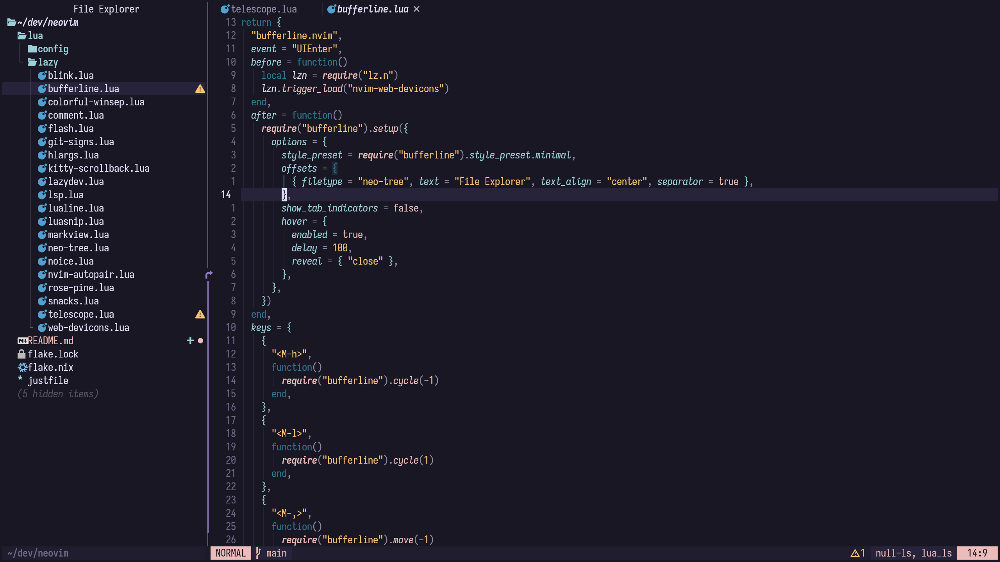

# Neovim Flake ❄️



## Getting started

### Run without installation

To test configuration without installing it, run the following command:

```bash
nix run github:drxxmy/neovim
```

### NixOS

```nix
# flake.nix
{
  inputs = {
    nixpkgs.url = "nixpkgs/nixos-unstable";
    neovim.url = "github:drxxmy/neovim";
  };

  outputs =
    { nixpkgs, neovim, ... }:
    let
      system = "x86_64-linux";
    in
    {
      # This will make Neovim available in your system packages
      nixosConfigurations.yourHostName = nixpkgs.lib.nixosSystem {
        modules = [
          {
            environment.systemPackages = [ neovim.packages.${system}.neovim ];
          }
        ];
      };
    };
}
```

### Home-Manager

```nix
# flake.nix
{
  inputs = {
    home-manager.url = "github:nix-community/home-manager";
    neovim.url = "github:drxxmy/neovim";
  };

  outputs =
    { home-manager, neovim, ... }:
    let
      system = "x86_64-linux";
    in
    {
      # This will make Neovim available on a user level.
      homeConfigurations."user@host" = home-manager.lib.homeManagerConfiguration {
        modules = [
          {
            home.packages = [ neovim.packages.${system}.neovim ];
          }
        ];
      };
    };
}
```
